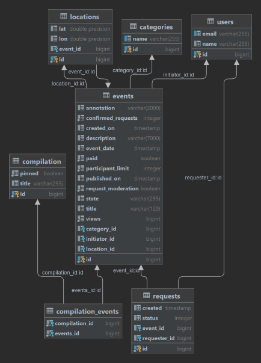
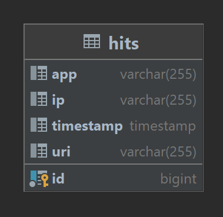
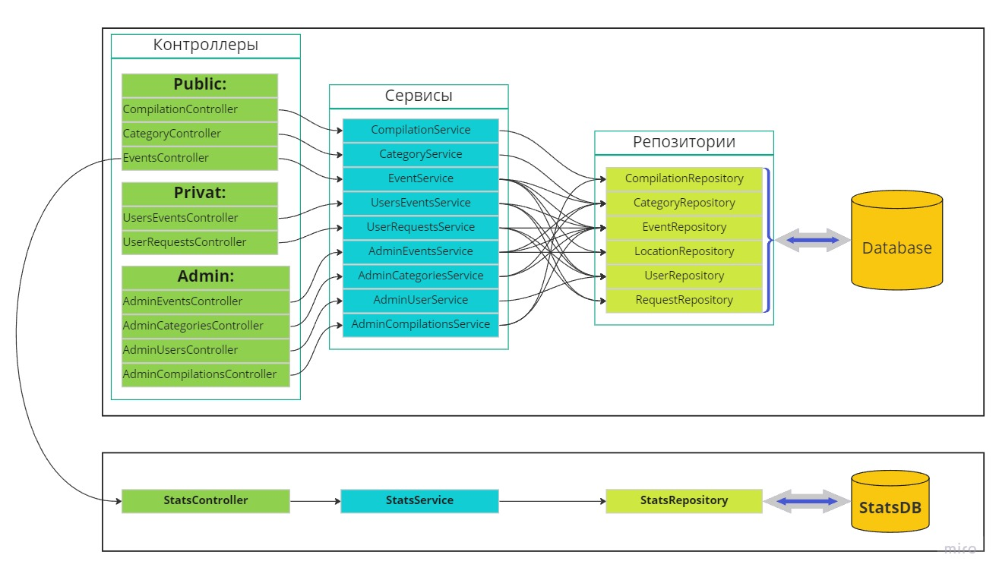

# Проект "Explore with me"

[Pull Request](https://github.com/klenars/java-explore-with-me/pull/1)

### Описание
Сервис-афиша, где можно предложить какое-либо событие от выставки до похода в кино и набрать компанию для участия в нём. 
[Документация всего проекта](javadoc/index.html)

### Используемые технологии
Java, Spring Boot, Lombok, JPA, Hibernate, PostgreSQL, H2, Maven, Docker, Javadoc

### Составные части проекта

#### 1. Основной микросервис
Запускается на порту 8080. 
Имеет отдельную Базу Данных. 
[Swagger спецификация основного сервиса](ewm-main-service-spec.json) 
[Postman тесты для основного сервиса](postman/ewm-main-service.json)  
Состоит из 2 частей:
1. **Приватная часть:** для зарегистрированных пользователей и администраторов сервиса. Позволяет создавать,
обновлять, удалять, модерировать события. Добавлять, удалять пользователей. Управлять запросами на участие в событиях.
Создавать, менять, удалять категории и подборки событий.
2. **Публичная часть:** для всех остальных пользователей, позволяет искать опубликованные события. Просматривать детальную
информацию о событии по его id.

#### Диаграмма БД основного сервиса

#### 2. Микросервис статистики
Запускается на порту 9090. 
Имеет отдельную Базу Данных. 
[Swagger спецификация сервиса статистики](ewm-stats-service-spec.json) 
[Postman тесты для сервиса статистики](postman/ewm-stat-service.json)  
Позволяет сохранять и получать статистические данные о запросах на публичную часть основного сервиса.  
Сохраняет и предоставляет информацию о:
 - адресах на которые поступали запросы
 - ip адресах пользователей делающих запросы
 - общем колличестве просмотров определенных событий
 - колличестве просмотров с уникальных ip
 - колличестве просмотров за определенный промежуток времени

#### Диаграмма БД сервиса статистики

### Условная схема взаимодейсвия компонентов проекта

### Порядок запуска проекта
- **В ручном режиме:**
    - Запустить БД сервиса статистики
    - Запустить сервис статистики
    - Запустить БД Основного сервиса
    - Запустить основной сервис
- **В автоматическом режиме:**
    - Для всех частей сервиса предусмотрен отдельный Docker-контейнер
    - Сборка всего проекта **maven -clean -install**
    - Общий запуск из корневой папки командой **docker compose up**